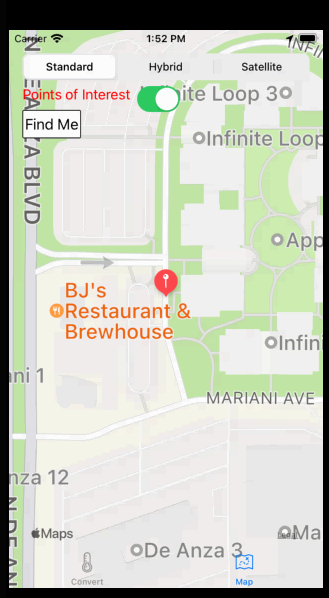
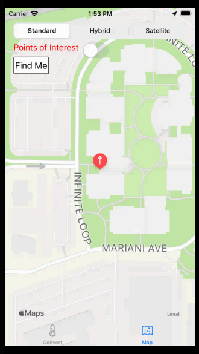

# WorldTrotter

Using the information from the BNR textbook, the World Trotter App was modified to add points of interest and adding a "Find Me" button using the current location of the phone's GPS. 

## Points of Interest and Find Me

The images below show the comparision of the "points of interest" switch being active and not active. This toggles whether the points of interests are shown on the map or not. The "Find Me" button was used to add the marker. The simulator location chosen was the "City Bicycle Route". Using this allowed the user to select "Find Me" multiple times to demonstrate the updating marker annotation feature. 

## Feature Notes

 - The project files are using the iOS simulator 14.0 (I think). I did see the screen prompting me to allow location once. However, I was not able to duplicate that series of events again. 

 - There is no temperature screen as shown in the book. 
